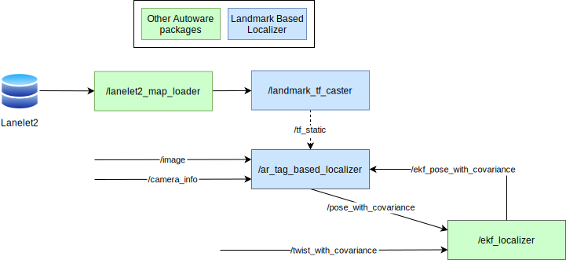

# Landmark Based Localizer

This directory contains packages for landmark-based localization.

Landmarks are, for example

- AR tags detected by camera
- Boards characterized by intensity detected by LiDAR

etc.

Since these landmarks are easy to detect and estimate pose, the ego pose can be calculated from the pose of the detected landmark if the pose of the landmark is written on the map in advance.

Currently, landmarks are assumed to be flat.

The following figure shows the principle of localization in the case of `ar_tag_based_localizer`.


This calculated ego pose is passed to the EKF, where it is fused with the twist information and used to estimate a more accurate ego pose.

## Node diagram



### `landmark_tf_caster` node

The definitions of the landmarks written to the map are introduced in the next section. See `Map Specifications`.

The `landmark_tf_caster` node publishes the TF from the map to the landmark.

- Translation : The center of the four vertices of the landmark
- Rotation : Let the vertex numbers be 1, 2, 3, 4 counterclockwise as shown in the next section. Direction is defined as the cross product of the vector from 1 to 2 and the vector from 2 to 3.

Users can define landmarks as Lanelet2 4-vertex polygons.
In this case, it is possible to define an arrangement in which the four vertices cannot be considered to be on the same plane. The direction of the landmark in that case is difficult to calculate.
So, if the 4 vertices are considered as forming a tetrahedron and its volume exceeds the `volume_threshold` parameter, the landmark will not publish tf_static.

### Landmark based localizer packages

- ar_tag_based_localizer
- etc.

## Inputs / Outputs

### `landmark_tf_caster` node

#### Input

| Name                   | Type                                         | Description      |
| :--------------------- | :------------------------------------------- | :--------------- |
| `~/input/lanelet2_map` | `autoware_auto_mapping_msgs::msg::HADMapBin` | Data of lanelet2 |

#### Output

| Name        | Type                                   | Description        |
| :---------- | :------------------------------------- | :----------------- |
| `tf_static` | `geometry_msgs::msg::TransformStamped` | TF from map to tag |

## Map specifications

For this package to work correctly, the poses of the landmarks must be specified in the Lanelet2 map format that `map_loader` and `landmark_tf_caster` can interpret.

The four vertices of a landmark are defined counterclockwise.

The order of the four vertices is defined as follows. In the coordinate system of a landmark,

- the x-axis is parallel to the vector from the first vertex to the second vertex
- the y-axis is parallel to the vector from the second vertex to the third vertex


### Example of `lanelet2_map.osm`

The values provided below are placeholders.
Ensure to input the correct coordinates corresponding to the actual location where the landmark is placed, such as `lat`, `lon`, `mgrs_code`, `local_x`, `local_y`.

For example, when using the AR tag, it would look like this.

```xml
...

  <node id="1" lat="35.8xxxxx" lon="139.6xxxxx">
    <tag k="mgrs_code" v="99XXX000000"/>
    <tag k="local_x" v="22.2356"/>
    <tag k="local_y" v="87.4506"/>
    <tag k="ele" v="2.1725"/>
  </node>
  <node id="2" lat="35.8xxxxx" lon="139.6xxxxx">
    <tag k="mgrs_code" v="99XXX000000"/>
    <tag k="local_x" v="22.639"/>
    <tag k="local_y" v="87.5886"/>
    <tag k="ele" v="2.5947"/>
  </node>
  <node id="3" lat="35.8xxxxx" lon="139.6xxxxx">
    <tag k="mgrs_code" v="99XXX000000"/>
    <tag k="local_x" v="22.2331"/>
    <tag k="local_y" v="87.4713"/>
    <tag k="ele" v="3.0208"/>
  </node>
  <node id="4" lat="35.8xxxxx" lon="139.6xxxxx">
    <tag k="mgrs_code" v="99XXX000000"/>
    <tag k="local_x" v="21.8298"/>
    <tag k="local_y" v="87.3332"/>
    <tag k="ele" v="2.5985"/>
  </node>

...

  <way id="5">
    <nd ref="1"/>
    <nd ref="2"/>
    <nd ref="3"/>
    <nd ref="4"/>
    <tag k="type" v="pose_marker"/>
    <tag k="subtype" v="apriltag_16h5"/>
    <tag k="area" v="yes"/>
    <tag k="marker_id" v="0"/>
  </way>

...

```
