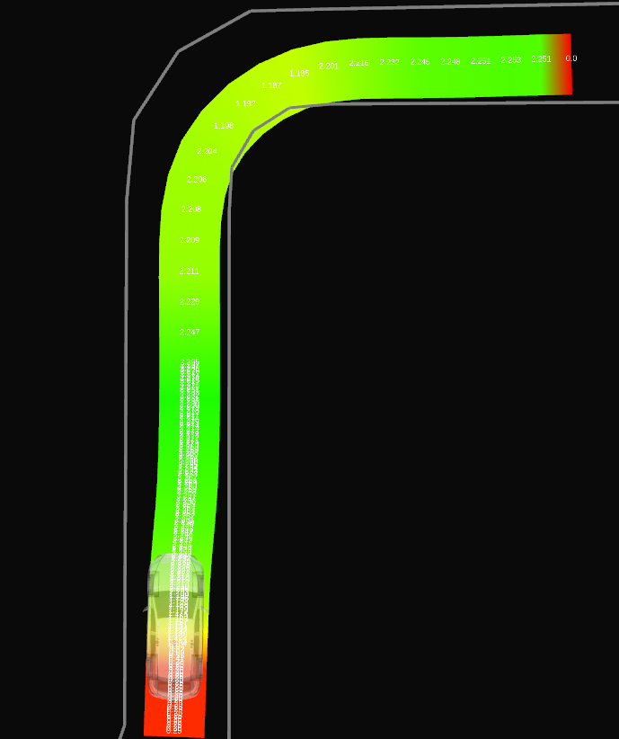
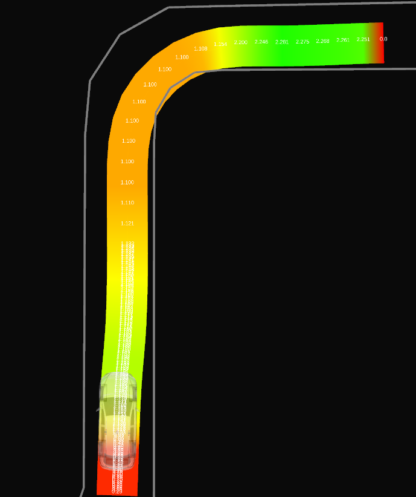

# Obstacle Velocity Limiter

## Purpose

This node limits the velocity when driving in the direction of an obstacle.
For example, it allows to reduce the velocity when driving close to a guard rail in a curve.

|                                     Without this node | With this node                                      |
| ----------------------------------------------------: | :-------------------------------------------------- |
|  |  |

## Inner-workings / Algorithms

Using a parameter `min_ttc` (minimum time to collision), the node set velocity limits such that
no collision with an obstacle would occur, even without new control inputs for a duration of `min_ttc`.

To achieve this, the motion of the ego vehicle is simulated forward in time at each point of the trajectory to create a corresponding footprint.
If the footprint collides with some obstacle, the velocity at the trajectory point is reduced such that the new simulated footprint do not have any collision.

### Simulated Motion, Footprint, and Collision Distance

The motion of the ego vehicle is simulated at each trajectory point using the `heading`, `velocity`, and `steering` defined at the point.
Footprints are then constructed from these simulations and checked for collision.
If a collision is found, the distance from the trajectory point is used to calculate the adjusted velocity that would produce a collision-free footprint. Parameter `simulation.distance_method` allow to switch between an exact distance calculation and a less expensive approximation using a simple euclidean distance.

Two models can be selected with parameter `simulation.model` for simulating the motion of the vehicle: a simple particle model and a more complicated bicycle model.

#### Particle Model

The particle model uses the constant heading and velocity of the vehicle at a trajectory point to simulate the future motion.
The simulated forward motion corresponds to a straight line and the footprint to a rectangle.

##### Footprint

The rectangle footprint is built from 2 lines parallel to the simulated forward motion and at a distance of half the vehicle width.

##### Distance

When a collision point is found within the footprint, the distance is calculated as described in the following figure.

#### Bicycle Model

The bicycle model uses the constant heading, velocity, and steering of the vehicle at a trajectory point to simulate the future motion.
The simulated forward motion corresponds to an arc around the circle of curvature associated with the steering.
Uncertainty in the steering can be introduced with the `simulation.steering_offset` parameter which will generate a range of motion from a left-most to a right-most steering.
This results in 3 curved lines starting from the same trajectory point.
A parameter `simulation.nb_points` is used to adjust the precision of these lines, with a minimum of `2` resulting in straight lines and higher values increasing the precision of the curves.

By default, the steering values contained in the trajectory message are used.
Parameter `trajectory_preprocessing.calculate_steering_angles` allows to recalculate these values when set to `true`.

##### Footprint

The footprint of the bicycle model is created from lines parallel to the left and right simulated motion at a distance of half the vehicle width.
In addition, the two points on the left and right of the end point of the central simulated motion are used to complete the polygon.

##### Distance

The distance to a collision point is calculated by finding the curvature circle passing through the trajectory point and the collision point.

### Obstacle Detection

Obstacles are represented as points or linestrings (i.e., sequence of points) around the obstacles and are constructed from an occupancy grid, a pointcloud, or the lanelet map.
The lanelet map is always checked for obstacles but the other source is switched using parameter `obstacles.dynamic_source`.

To efficiently find obstacles intersecting with a footprint, they are stored in a [R-tree](https://www.boost.org/doc/libs/1_80_0/libs/geometry/doc/html/geometry/reference/spatial_indexes/boost__geometry__index__rtree.html).
Two trees are used, one for the obstacle points, and one for the obstacle linestrings (which are decomposed into segments to simplify the R-tree).

#### Obstacle masks

##### Dynamic obstacles

Moving obstacles such as other cars should not be considered by this module.
These obstacles are detected by the perception modules and represented as polygons.
Obstacles inside these polygons are ignored.

Only dynamic obstacles with a velocity above parameter `obstacles.dynamic_obstacles_min_vel` are removed.

To deal with delays and precision errors, the polygons can be enlarged with parameter `obstacles.dynamic_obstacles_buffer`.

##### Obstacles outside of the safety envelope

Obstacles that are not inside any forward simulated footprint are ignored if parameter `obstacles.filter_envelope` is set to true.
The safety envelope polygon is built from all the footprints and used as a positive mask on the occupancy grid or pointcloud.

This option can reduce the total number of obstacles which reduces the cost of collision detection.
However, the cost of masking the envelope is usually too high to be interesting.

##### Obstacles on the ego path

If parameter `obstacles.ignore_obstacles_on_path` is set to `true`, a polygon mask is built from the trajectory and the vehicle dimension. Any obstacle in this polygon is ignored.

The size of the polygon can be increased using parameter `obstacles.ignore_extra_distance` which is added to the vehicle lateral offset.

This option is a bit expensive and should only be used in case of noisy dynamic obstacles where obstacles are wrongly detected on the ego path, causing unwanted velocity limits.

#### Lanelet Map

Information about static obstacles can be stored in the Lanelet map using the value of the `type` tag of linestrings.
If any linestring has a `type` with one of the value from parameter `obstacles.static_map_tags`, then it will be used as an obstacle.

Obstacles from the lanelet map are not impacted by the masks.

#### Occupancy Grid

Masking is performed by iterating through the cells inside each polygon mask using the [`grid_map_utils::PolygonIterator`](https://github.com/autowarefoundation/autoware.universe/tree/main/common/grid_map_utils) function.
A threshold is then applied to only keep cells with an occupancy value above parameter `obstacles.occupancy_grid_threshold`.
Finally, the image is converted to an image and obstacle linestrings are extracted using the opencv function
[`findContour`](https://docs.opencv.org/3.4/d3/dc0/group__imgproc__shape.html#ga17ed9f5d79ae97bd4c7cf18403e1689a).

#### Pointcloud

Masking is performed using the [`pcl::CropHull`](https://pointclouds.org/documentation/classpcl_1_1_crop_hull.html) function.
Points from the pointcloud are then directly used as obstacles.

### Velocity Adjustment

If a collision is found, the velocity at the trajectory point is adjusted such that the resulting footprint would no longer collide with an obstacle:
$velocity = \frac{dist\_to\_collision}{min\_ttc}$

To prevent sudden deceleration of the ego vehicle, the parameter `max_deceleration` limits the deceleration relative to the current ego velocity.
For a trajectory point occurring at a duration `t` in the future (calculated from the original velocity profile),
the adjusted velocity cannot be set lower than $v_{current} - t * max\_deceleration$.

Furthermore, a parameter `min_adjusted_velocity`
provides a lower bound on the modified velocity.

### Trajectory preprocessing

The node only modifies part of the input trajectory, starting from the current ego position.
Parameter `trajectory_preprocessing.start_distance` is used to adjust how far ahead of the ego position the velocities will start being modified.
Parameters `trajectory_preprocessing.max_length` and `trajectory_preprocessing.max_duration` are used to control how much of the trajectory will see its velocity adjusted.

To reduce computation cost at the cost of precision, the trajectory can be downsampled using parameter `trajectory_preprocessing.downsample_factor`.
For example a value of `1` means all trajectory points will be evaluated while a value of `10` means only 1/10th of the points will be evaluated.

## Inputs / Outputs

### Inputs

| Name                          | Type                                             | Description                                        |
| ----------------------------- | ------------------------------------------------ | -------------------------------------------------- |
| `~/input/trajectory`          | `autoware_auto_planning_msgs/Trajectory`         | Reference trajectory                               |
| `~/input/occupancy_grid`      | `nav_msgs/OccupancyGrid`                         | Occupancy grid with obstacle information           |
| `~/input/obstacle_pointcloud` | `sensor_msgs/PointCloud2`                        | Pointcloud containing only obstacle points         |
| `~/input/dynamic_obstacles`   | `autoware_auto_perception_msgs/PredictedObjects` | Dynamic objects                                    |
| `~/input/odometry`            | `nav_msgs/Odometry`                              | Odometry used to retrieve the current ego velocity |
| `~/input/map`                 | `autoware_auto_mapping_msgs/HADMapBin`           | Vector map used to retrieve static obstacles       |

### Outputs

| Name                            | Type                                     | Description                                              |
| ------------------------------- | ---------------------------------------- | -------------------------------------------------------- |
| `~/output/trajectory`           | `autoware_auto_planning_msgs/Trajectory` | Trajectory with adjusted velocities                      |
| `~/output/debug_markers`        | `visualization_msgs/MarkerArray`         | Debug markers (envelopes, obstacle polygons)             |
| `~/output/runtime_microseconds` | `tier4_debug_msgs/Float64`               | Time taken to calculate the trajectory (in microseconds) |

## Parameters

| Name                                                | Type        | Description                                                                                                                             |
| --------------------------------------------------- | ----------- | --------------------------------------------------------------------------------------------------------------------------------------- |
| `min_ttc`                                           | float       | [s] required minimum time with no collision at each point of the trajectory assuming constant heading and velocity.                     |
| `distance_buffer`                                   | float       | [m] required distance buffer with the obstacles.                                                                                        |
| `min_adjusted_velocity`                             | float       | [m/s] minimum adjusted velocity this node can set.                                                                                      |
| `max_deceleration`                                  | float       | [m/s²] maximum deceleration an adjusted velocity can cause.                                                                             |
| `trajectory_preprocessing.start_distance`           | float       | [m] controls from which part of the trajectory (relative to the current ego pose) the velocity is adjusted.                             |
| `trajectory_preprocessing.max_length`               | float       | [m] controls the maximum length (starting from the `start_distance`) where the velocity is adjusted.                                    |
| `trajectory_preprocessing.max_distance`             | float       | [s] controls the maximum duration (measured from the `start_distance`) where the velocity is adjusted.                                  |
| `trajectory_preprocessing.downsample_factor`        | int         | trajectory downsampling factor to allow tradeoff between precision and performance.                                                     |
| `trajectory_preprocessing.calculate_steering_angle` | bool        | if true, the steering angles of the trajectory message are not used but are recalculated.                                               |
| `simulation.model`                                  | string      | model to use for forward simulation. Either "particle" or "bicycle".                                                                    |
| `simulation.distance_method`                        | string      | method to use for calculating distance to collision. Either "exact" or "approximation".                                                 |
| `simulation.steering_offset`                        | float       | offset around the steering used by the bicycle model.                                                                                   |
| `simulation.nb_points`                              | int         | number of points used to simulate motion with the bicycle model.                                                                        |
| `obstacles.dynamic_source`                          | string      | source of dynamic obstacle used for collision checking. Can be "occupancy_grid", "point_cloud", or "static_only" (no dynamic obstacle). |
| `obstacles.occupancy_grid_threshold`                | int         | value in the occupancy grid above which a cell is considered an obstacle.                                                               |
| `obstacles.dynamic_obstacles_buffer`                | float       | buffer around dynamic obstacles used when masking an obstacle in order to prevent noise.                                                |
| `obstacles.dynamic_obstacles_min_vel`               | float       | velocity above which to mask a dynamic obstacle.                                                                                        |
| `obstacles.static_map_tags`                         | string list | linestring of the lanelet map with this tags are used as obstacles.                                                                     |
| `obstacles.filter_envelope`                         | bool        | wether to use the safety envelope to filter the dynamic obstacles source.                                                               |

## Assumptions / Known limits

The velocity profile produced by this node is not meant to be a realistic velocity profile
and can contain sudden jumps of velocity with no regard for acceleration and jerk.
This velocity profile is meant to be used as an upper bound on the actual velocity of the vehicle.

## (Optional) Error detection and handling

The critical case for this node is when an obstacle is falsely detected very close to the trajectory such that
the corresponding velocity suddenly becomes very low.
This can cause a sudden brake and two mechanisms can be used to mitigate these errors.

Parameter `min_adjusted_velocity` allow to set a minimum to the adjusted velocity, preventing the node to slow down the vehicle too much.
Parameter `max_deceleration` allow to set a maximum deceleration (relative to the _current_ ego velocity) that the adjusted velocity would incur.

## (Optional) Performance characterization

## (Optional) References/External links

## (Optional) Future extensions / Unimplemented parts
